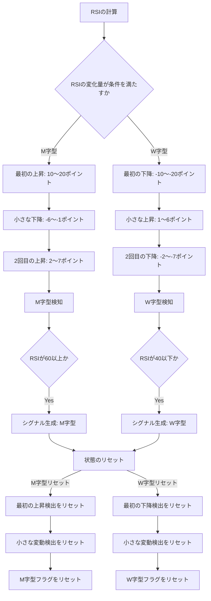

# シグナル名: `rsi_m_w_shape_detection`

---

## このシグナルのスコープ
このシグナルが適用される範囲や条件を示します。

- **スコープ1**: RSIのダブルトップ（M字）の検出
- **スコープ2**: RSIのダブルボトム（W字）の検出

---

## より精度を高めるためのフィルタリング機能
このシグナルの精度を高めるために適用されるフィルタリング機能を列挙し、説明します。

- **機能1**: M字ではRSIが60以下ではシグナルなし
- **機能2**: W字ではRSIが40以上ではシグナルなし

---

## シグナルのロジック
このシグナルがどのように機能するか、具体的なロジックを説明します。シグナルがどのように計算され、どの条件下でトリガーされるかを記述します。

- **説明**: 〇〇の指標を元に、△△の基準で異常検知を行うロジック。例えば、RSIが70を超えた場合にアラートを発生させる等。

